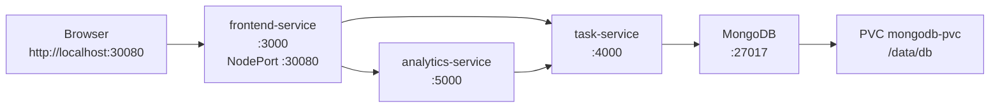
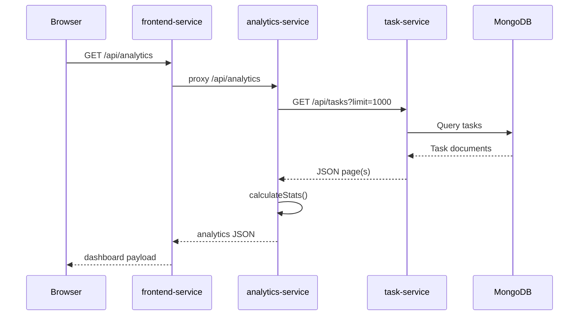
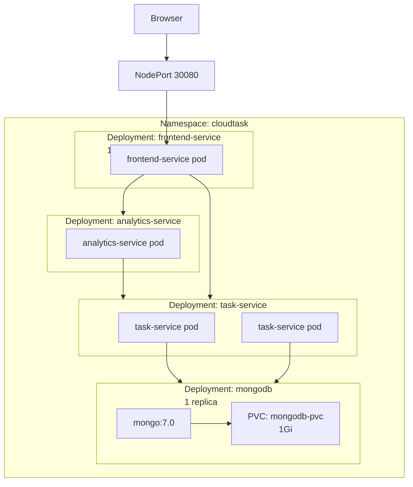
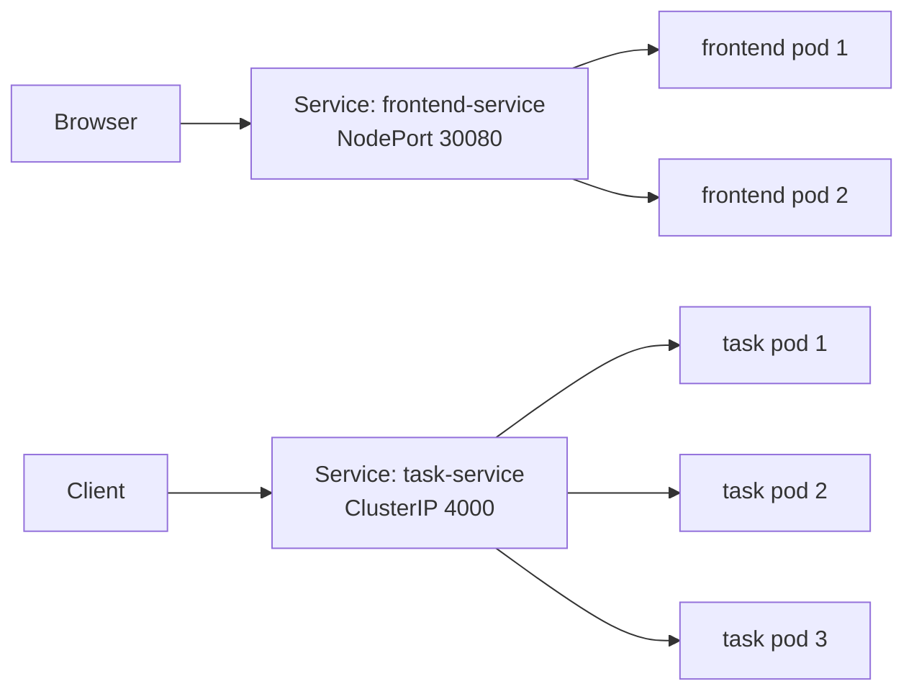

# CloudTask – Report Source Pack

This document is the factual source pack for the CloudTask project. It is based on the actual implementation, Kubernetes manifests, Dockerfiles, scripts, and runtime evidence in the current workspace. It intentionally avoids academic speculation and only records project-verified facts.

## 1. Project identification

- Project name: CloudTask
- Purpose: Demonstrate a microservices-based task system with a browser frontend, REST task CRUD, analytics derived from the task API, and persistent storage using MongoDB.
- Problem it demonstrates: Independent service decomposition, Docker containerization, Kubernetes orchestration, inter-service communication, persistence, scaling, and runtime verification.
- Main technologies:
  - Node.js + Express
  - MongoDB
  - Docker
  - Kubernetes / Docker Desktop Kubernetes
  - PowerShell scripts for build/deploy/verification
- Programming languages:
  - JavaScript (ES modules)
  - YAML
  - PowerShell
- Runtime versions known from project files and runtime validation:
  - Node.js 22-based container image (`node:22-alpine` in all Dockerfiles)
  - MongoDB 7.0 (`mongo:7.0`)
  - Docker Desktop 4.91.0 and Docker Engine 29.8.0 were active during successful runtime verification
- Database: MongoDB 7.0
- Container technology: Docker
- Orchestration technology: Kubernetes Deployments and Services, with Docker Desktop single-node Kubernetes cluster
- Development environment: local Windows environment; Node.js services and PowerShell scripts; Docker Desktop with Linux containers and Kubernetes enabled
- Final external application URL: `http://localhost:30080`
- Docker Hub account/repository: `adjaino/cloudtask`
- Docker image names/tags (verified in project scripts and acceptance evidence):
  - `adjaino/cloudtask:frontend-1.0.0`
  - `adjaino/cloudtask:task-service-1.0.0`
  - `adjaino/cloudtask:analytics-service-1.0.0`
- Git repository status:
  - At the time of final source inspection, `git status --short --branch` returned: `fatal: not a git repository (or any of the parent directories): .git`.
  - The acceptance document in this workspace states that a local Git repository was initialized after runtime acceptance passed, but the current checked-out directory is not a Git repo in this environment.

Primary sources:
- `README.md`
- `docs/ACCEPTANCE.md`
- `scripts/build-and-push.ps1`
- `scripts/deploy-kubernetes.ps1`
- `kubernetes/*.yaml`

---

## 2. Exact final architecture

### Actual service flow

1. Browser
2. Frontend Service (`frontend-service`)
3. Task Service (`task-service`)
4. MongoDB (`mongodb`)

And:

1. Browser
2. Frontend Service (`frontend-service`)
3. Analytics Service (`analytics-service`)
4. Task Service (`task-service`)

The frontend proxies browser requests to internal backend services rather than exposing internal service names to the browser. The analytics service does not connect to MongoDB directly; it calls the Task Service REST API and aggregates task data from there.

### Public exposure

- The only service publicly exposed to the browser is the `frontend-service` via a Kubernetes `NodePort` service on port `30080`.
- `frontend-service` is exposed as `type: NodePort` with `nodePort: 30080`.
- All backend services use `ClusterIP` for internal-only networking.

### Service-to-service dependency map

- `frontend-service` -> `task-service` via `http://task-service:4000`
- `frontend-service` -> `analytics-service` via `http://analytics-service:5000`
- `analytics-service` -> `task-service` via `http://task-service:4000`
- `task-service` -> MongoDB via `mongodb://<credentials>@mongodb:27017/cloudtask?authSource=admin` inside Kubernetes
- MongoDB -> volume-backed PVC at `/data/db`

### Internal host/service names

Kubernetes names used in manifests/config:
- `mongodb`
- `task-service`
- `analytics-service`
- `frontend-service`

These are the names used for service discovery in the cluster.

### Ports used by each app

- Frontend: port `3000` inside container, NodePort `30080` externally
- Task Service: port `4000`
- Analytics Service: port `5000`
- MongoDB: port `27017`

### Architecture diagram (textual)

```text
Browser
  │
  ▼
frontend-service:3000 (NodePort 30080)
  │
  ├── /api/tasks  ──> task-service:4000
  │
  └── /api/analytics ──> analytics-service:5000
                             │
                             └── fetches /api/tasks from task-service:4000

task-service:4000
  └── MongoDB:27017

MongoDB:27017
  └── PVC mongodb-pvc /data/db
```

### Kubernetes DNS/service discovery

The services and config maps rely on Kubernetes internal DNS. The browser reaches the frontend via the NodePort on the host machine (`http://localhost:30080`), but backend services use internal service names like `task-service`, `analytics-service`, and `mongodb` because the browser is not expected to resolve Kubernetes internal DNS from outside the cluster.

### Exact source references

- `kubernetes/10-configmap.yaml`
- `kubernetes/12-mongodb.yaml`
- `kubernetes/20-task-service.yaml`
- `kubernetes/30-analytics-service.yaml`
- `kubernetes/40-frontend-service.yaml`
- `frontend-service/src.js`
- `analytics-service/src/server.js`
- `task-service/src/server.js`

---

## 3. Complete component inventory

| Component | Technology | Port | Responsibility | Kubernetes Resource | Exposure | Dependencies |
|---|---|---:|---|---|---|---|
| Frontend Service | Node.js + Express + static browser app | 3000 | Serves the browser UI and proxies `/api/tasks` and `/api/analytics` to backend services | Deployment `frontend-service`; Service `frontend-service` | Public via NodePort `30080` | `task-service`, `analytics-service` |
| Task Service | Node.js + Express + MongoDB Mongoose | 4000 | CRUD task API, validation, MongoDB persistence, health/readiness | Deployment `task-service`; Service `task-service` | Internal only (`ClusterIP`) | MongoDB |
| Analytics Service | Node.js + Express + fetch to Task Service | 5000 | Calls Task Service API and calculates task statistics | Deployment `analytics-service`; Service `analytics-service` | Internal only (`ClusterIP`) | `task-service` |
| MongoDB | MongoDB 7.0 | 27017 | Stores tasks and persists data | Deployment `mongodb`; Service `mongodb` | Internal only (`ClusterIP`) | PVC `mongodb-pvc` |
| ConfigMap | Kubernetes ConfigMap | N/A | Stores service URLs and timeout settings | `cloudtask-config` | Internal | All app Deployments |
| Secret | Kubernetes Secret | N/A | Stores MongoDB username/password | `mongodb-secret` | Internal | MongoDB |
| PVC | Kubernetes PersistentVolumeClaim | N/A | Persistent database storage | `mongodb-pvc` | Internal | MongoDB |
| Ingress | Kubernetes Ingress | N/A | Optional host-based route for `cloudtask.local` | `cloudtask-ingress` | Optional, not active by default in this runtime setup | `frontend-service` |
| NetworkPolicy | Kubernetes NetworkPolicy | N/A | Restricts ingress by pod label | `mongodb-only-from-task-service`, `task-service-ingress`, `analytics-service-ingress` | Internal | Network CNI support required |

### Component details

#### Frontend Service
- Purpose: Serve static UI and act as a browser-facing proxy.
- Technology: Node.js + Express + Helmet + static files in `frontend-service/public`.
- Source directory: `frontend-service/`
- Important files:
  - `frontend-service/src.js`
  - `frontend-service/public/index.html`
  - `frontend-service/public/app.js`
  - `frontend-service/public/styles.css`
- Deployment: `kubernetes/40-frontend-service.yaml`
- Replica configuration: `replicas: 1` in the YAML; scaling was verified live by increasing to `2`.
- Exposure: NodePort 30080
- Dependencies: `task-service`, `analytics-service`

#### Task Service
- Purpose: Own task data and CRUD operations.
- Technology: Express, Mongoose, Helmet, rate limiting, validation
- Source directory: `task-service/`
- Important files:
  - `task-service/src/server.js`
  - `task-service/src/validation.js`
  - `task-service/test/validation.test.js`
- Deployment: `kubernetes/20-task-service.yaml`
- Replica configuration: `replicas: 2` default in YAML
- Exposure: `ClusterIP` service only
- Dependencies: MongoDB

#### Analytics Service
- Purpose: Query the task service and calculate aggregate statistics.
- Technology: Express + fetch + calculated statistics module
- Source directory: `analytics-service/`
- Important files:
  - `analytics-service/src/server.js`
  - `analytics-service/src/stats.js`
  - `analytics-service/test/stats.test.js`
- Deployment: `kubernetes/30-analytics-service.yaml`
- Replica configuration: `replicas: 1` default in YAML
- Exposure: `ClusterIP` service only
- Dependencies: `task-service`

#### MongoDB
- Purpose: Database backend for task records.
- Technology: MongoDB 7.0 official image
- Source directory: none; runtime container image
- Deployment: `kubernetes/12-mongodb.yaml`
- Replica configuration: `replicas: 1`
- Exposure: `ClusterIP`
- Dependencies: PVC `mongodb-pvc` and Kubernetes Secret `mongodb-secret`

---

## 4. Task Service

### Exact REST API

The task service is implemented in `task-service/src/server.js` and validates inputs using `task-service/src/validation.js`.

#### Health and readiness

- `GET /health` returns `{"status":"ok","service":"task-service"}`
- `GET /ready` returns:
  - `200` with `{ "status": "ready", "database": "connected" }` when MongoDB is connected
  - `503` with `{ "status": "not-ready", "database": "disconnected" }` when disconnected

#### CRUD endpoints

| Method | Endpoint | Purpose | Important responses |
|---|---|---|---|
| GET | `/api/tasks` | List filtered tasks; supports pagination and limit | `200`, `400` for invalid filters or limit |
| GET | `/api/tasks/:id` | Fetch a single task | `200`, `400` invalid ID, `404` not found |
| POST | `/api/tasks` | Create a task | `201` on success, `400` validation, `413` body too large |
| PATCH | `/api/tasks/:id` | Partially update a task | `200`, `400`, `404` |
| DELETE | `/api/tasks/:id` | Delete a task | `204` on success, `400`, `404` |

### Request fields and validation

Supported task fields from validation:
- `title` (required, string, max 120 chars, trimmed)
- `description` (optional string, max 1000 chars)
- `status` allowed values: `pending`, `in-progress`, `completed`
- `priority` allowed values: `low`, `medium`, `high`
- `dueDate` optional date string or null

Validation rules come from `validateTaskInput` in `task-service/src/validation.js`.

### Supported task status values

`ALLOWED_STATUS = new Set(["pending", "in-progress", "completed"])`

### Priority values

`ALLOWED_PRIORITY = new Set(["low", "medium", "high"])`

### Pagination implementation

`GET /api/tasks` supports:
- `status` filter
- `priority` filter
- `limit` from 1 to 1000 (default 200 if not supplied)
- `before` cursor for descending-ID pagination

Implementation detail:
- `Task.find(filter).sort({ _id: -1 }).limit(limit + 1).lean()`
- returns `{ count, tasks, nextCursor }`
- `nextCursor` is the last ID when more results exist
- analytics and frontend follow pagination to fetch all pages

### Error handling

The task service has custom error handling in `task-service/src/server.js`:
- invalid JSON -> `400 { error: "Invalid JSON" }`
- request body too large -> `413 { error: "Request body too large" }`
- database unavailable -> `503 { error: "Database unavailable" }`
- invalid task validation -> `400 { error: "Task validation failed" }`
- any other application error -> `500 { error: "Internal server error" }`

### Invalid ID / missing record handling

- Invalid object IDs: `400 { error: "Invalid task id" }`
- Task not found: `404 { error: "Task not found" }`

### MongoDB connection behaviour

The service builds a MongoDB URI in this priority order:
- `process.env.MONGO_URI` if set
- otherwise `mongodb://<username>:<password>@<host>:<port>/<db>?authSource=admin`

Relevant code:
- `task-service/src/server.js` lines around the MongoDB URI generation and `connectWithRetry()`

Important implementation detail:
- `connectWithRetry()` attempts MongoDB connection up to 30 times
- on failure, waits 2 seconds and retries
- this prevents startup failure while MongoDB finishes becoming ready in Kubernetes

### Rate limiting and security middleware

The service uses:
- `app.disable("x-powered-by")`
- `helmet()`
- `express.json({ limit: "32kb" })`
- `express-rate-limit` with a 60-second window and a 240-request limit per window

Request logging:
- every request logs method, URL, and status code with elapsed milliseconds

### Source files

- `task-service/src/server.js`
- `task-service/src/validation.js`
- `task-service/test/validation.test.js`
- `kubernetes/20-task-service.yaml`

---

## 5. Analytics Service

### Exact endpoint(s)

- `GET /health`
- `GET /api/analytics`

The analytics service does not expose task mutation endpoints; it only reads task data from Task Service.

### Statistics calculated

The calculation is implemented in `analytics-service/src/stats.js`.

It computes:
- `total`
- `byStatus` with keys `pending`, `in-progress`, `completed`
- `byPriority` with keys `low`, `medium`, `high`
- `overdue`
- `dueNext7Days`
- `completionRate`
- `generatedAt`

The logic:
- counts tasks by status and priority
- marks overdue tasks when `task.dueDate < now` and task is not completed
- counts due dates within the next 7 days
- computes `completionRate = completed / total * 100`

### Exact mechanism for calling Task Service

`analytics-service/src/server.js` uses the JavaScript `fetch` API with a `URL` object and pagination loop:

```
const url = new URL("/api/tasks", taskServiceUrl);
url.searchParams.set("limit", "1000");
if (cursor) url.searchParams.set("before", cursor);
const response = await fetch(url, { headers: { accept: "application/json" }, signal: controller.signal });
```

It loops through all pages until `nextCursor` is null.

### Task Service URL configuration

- `TASK_SERVICE_URL` default is `http://localhost:4000`
- in Kubernetes it is set to `http://task-service:4000` via ConfigMap
- analytics can be run locally or in container mode with different values in environment variables

### Pagination behaviour

The analytics service explicitly follows all pages from the Task Service by repeatedly calling `/api/tasks` with `limit=1000` and `before=<cursor>` until paging is complete.

### HTTP timeout behaviour

- Environment variable `REQUEST_TIMEOUT_MS` default is `4000`
- in Kubernetes config it is set to `5000` on frontend and `4000` on Analytics
- `AbortController` and `setTimeout` abort the fetch if the request exceeds the timeout

### Error handling and downstream outage behaviour

When Task Service returns a non-OK response or the request times out, the analytics service returns:

```json
{
  "error": "Task Service is currently unavailable",
  "service": "analytics-service"
}
```

HTTP status: `503`

This is the evidence that analytics is designed to fail gracefully when its dependency is unavailable.

### Why it does not access MongoDB directly

The project requirement and implementation clearly separate concerns:
- Task Service owns the database access layer
- Analytics Service owns aggregation and reporting
- It is intentionally implemented as a REST client to the Task Service, demonstrating service-to-service integration rather than database access from each service

This is consistent with the documented architecture and the runtime implementation.

### Health endpoint

- `GET /health` returns `{"status":"ok","service":"analytics-service"}`

### Logging

The analytics service logs:
- request method and URL with status and duration on each response
- upstream Task Service calls (`GET task-service/api/tasks -> <status>`)
- downstream failures with `console.error("analytics-service could not query task-service", error.message)`

### Limitation relevant to analytics

The API reference states: `Concurrent writes do not provide a transactional snapshot.`

This is a real limitation of the implementation: analytics follows paginated task results while tasks can still be changing, so the returned statistics are not a strictly transactionally consistent snapshot at a single instant.

Primary sources:
- `analytics-service/src/server.js`
- `analytics-service/src/stats.js`
- `docs/API.md`
- `kubernetes/10-configmap.yaml`

---

## 6. Frontend Service

### Frontend technology

The frontend service is a Node.js+Express app that serves static files from `frontend-service/public`.

Important files:
- `frontend-service/src.js`
- `frontend-service/public/index.html`
- `frontend-service/public/app.js`
- `frontend-service/public/styles.css`

### Static browser content serving

The app uses:

```js
app.use(express.static(path.join(__dirname, "public"), { extensions: ["html"] }));
```

This means the browser receives the frontend HTML/JS/CSS without needing any separate UI framework or build step.

### Browser features implemented

The browser script (`frontend-service/public/app.js`) supports:
- create task
- list tasks
- filter by status
- edit task
- change status to pending/in-progress/completed
- delete task
- refresh
- fetch analytics
- render dashboard metrics for total, pending, in-progress, completed, overdue, completion rate

### Analytics/dashboard functionality

The frontend script loads analytics via:
- `GET /api/analytics`

Then updates the dashboard fields:
- `statTotal`
- `statPending`
- `statProgress`
- `statCompleted`
- `statOverdue`
- `statRate`

### API proxy implementation

The frontend uses `forward(req, res, baseUrl)` in `frontend-service/src.js`.

It forwards the browser requests to upstream services and preserves the upstream response payload to the browser.

Proxy routes:
- `app.use("/api/tasks", (req, res) => forward(req, res, taskServiceUrl));`
- `app.use("/api/analytics", (req, res) => forward(req, res, analyticsServiceUrl));`

#### Exact request paths for key operations

Create task:
- Browser -> `POST /api/tasks`
- Frontend proxies to `task-service` at `http://task-service:4000/api/tasks`

Load analytics:
- Browser -> `GET /api/analytics`
- Frontend proxies to `analytics-service` at `http://analytics-service:5000/api/analytics`

### Why browser does not use Kubernetes internal DNS

The browser runs outside the cluster and is not expected to resolve cluster-internal service names. The public access path is:
- browser -> `http://localhost:30080` -> NodePort service -> `frontend-service` pod -> internal proxy -> `task-service`/`analytics-service`

The browser therefore speaks to the frontend over the public NodePort, and the frontend is responsible for internal service discovery.

### Health endpoint

- `GET /health` returns `{"status":"ok","service":"frontend-service"}`

### Logging

The frontend logs every request with method, URL, status code, and elapsed time.

### Error handling

- upstream timeout -> `503 { error: "Upstream service timed out" }`
- service unavailable -> `503 { error: "Upstream service unavailable" }`
- invalid JSON/body too large -> `400` or `413`

Primary sources:
- `frontend-service/src.js`
- `frontend-service/public/app.js`
- `kubernetes/40-frontend-service.yaml`

---

## 7. Database

### Database technology

- MongoDB 7.0 official image
- Mongoose ODM in the Task Service connects to MongoDB

### Database name

The application uses the database name `cloudtask` by default.

### Local development connection

Local development uses:
- `mongodb://localhost:27017/cloudtask`
- set via `scripts/start-local.ps1`
- `MONGO_URI` environment variable from the script

### Kubernetes connection

Inside Kubernetes, the task service uses environment values from the ConfigMap and Secret:
- `MONGO_HOST=mongodb`
- `MONGO_PORT=27017`
- `MONGO_DB=cloudtask`
- credentials from `mongodb-secret`

The runtime URI is produced in `task-service/src/server.js` as a Mongoose URI using the credentials and `?authSource=admin`.

### Authentication configuration

The Kubernetes Secret is named `mongodb-secret` and stores:
- `MONGO_USERNAME`
- `MONGO_PASSWORD`

The example secret file exists at `examples/mongodb-secret.example.yaml` and is explicitly marked as an example only.

### Kubernetes Service name and port

- Service name: `mongodb`
- Service type: `ClusterIP`
- Port: `27017`

### Data directory and persistence method

- Data directory mount path: `/data/db`
- PVC: `mongodb-pvc`
- Size: `1Gi`
- Access mode: `ReadWriteOnce`
- StorageClass: default cluster StorageClass from Docker Desktop Kubernetes environment (`standard` / `rancher.io/local-path` was reported during runtime verification)

### Why database is not publicly exposed

The database is internal-only. The MongoDB service is a `ClusterIP`; it is not a `NodePort` or `LoadBalancer`, and no host port mapping is exposed outside the cluster.

### Local vs Kubernetes URI distinction

LOCAL DEVELOPMENT URI:
- `mongodb://localhost:27017/cloudtask`

KUBERNETES INTERNAL URI:
- `mongodb://<username>:<password>@mongodb:27017/cloudtask?authSource=admin`

No real passwords are recorded in the repository.

Primary sources:
- `scripts/start-local.ps1`
- `task-service/src/server.js`
- `kubernetes/10-configmap.yaml`
- `kubernetes/11-mongodb-pvc.yaml`
- `kubernetes/12-mongodb.yaml`
- `examples/mongodb-secret.example.yaml`

---

## 8. Docker implementation

### Custom images

All custom images are built from `node:22-alpine`.

#### Frontend image
- Source directory: `frontend-service/`
- Dockerfile: `frontend-service/Dockerfile`
- Workdir: `/app`
- Dependency install: `npm ci --omit=dev`
- Production command: `CMD ["node", "src.js"]`
- Exposed port: `3000`
- User: `USER node`
- Security choice: runs as non-root Node user

#### Task Service image
- Source directory: `task-service/`
- Dockerfile: `task-service/Dockerfile`
- Workdir: `/app`
- Dependency install: `npm ci --omit=dev`
- Production command: `CMD ["node", "src/server.js"]`
- Exposed port: `4000`
- User: `USER node`
- Security choice: runs as non-root Node user

#### Analytics image
- Source directory: `analytics-service/`
- Dockerfile: `analytics-service/Dockerfile`
- Workdir: `/app`
- Dependency install: `npm ci --omit=dev`
- Production command: `CMD ["node", "src/server.js"]`
- Exposed port: `5000`
- User: `USER node`
- Security choice: runs as non-root Node user

### Docker Hub images

The project builds and publishes these image names:
- `adjaino/cloudtask:task-service-1.0.0`
- `adjaino/cloudtask:analytics-service-1.0.0`
- `adjaino/cloudtask:frontend-1.0.0`

These names are created by `scripts/build-and-push.ps1`.

### Docker build-and-push script behaviour

`build-and-push.ps1`:
1. Accepts DockerHub username and tag parameters
2. Builds three images from the custom service directories
3. Pushes each image to Docker Hub
4. Throws if any external command fails

### Docker Compose implementation

`docker-compose.yml` defines:
- MongoDB service with named volume `mongodb_data`
- Task Service with `PORT=4000`, `MONGO_HOST=mongodb`, `MONGO_PORT=27017`, `MONGO_DB=cloudtask`
- Analytics Service with `PORT=5000`, `TASK_SERVICE_URL=http://task-service:4000`
- Frontend with `PORT=3000`, `TASK_SERVICE_URL=http://task-service:4000`, `ANALYTICS_SERVICE_URL=http://analytics-service:5000`
- port mapping `3000:3000` for the frontend only

The Compose setup is for local container orchestration, not the Kubernetes runtime used for final acceptance.

### .dockerignore behaviour

Each service `.dockerignore` excludes:
- `node_modules`
- logs
- `.env` and local secret files
- Docker metadata files
- test files in task-service and analytics-service

Primary sources:
- `task-service/Dockerfile`
- `analytics-service/Dockerfile`
- `frontend-service/Dockerfile`
- `scripts/build-and-push.ps1`
- `docker-compose.yml`

---

## 9. Kubernetes resource inventory

### YAML files inventory

| File | Kind | Resource Name | Purpose |
|---|---|---|---|
| `kubernetes/00-namespace.yaml` | Namespace | `cloudtask` | Creates the application namespace |
| `kubernetes/10-configmap.yaml` | ConfigMap | `cloudtask-config` | Stores service URLs and timeout config |
| `kubernetes/11-mongodb-pvc.yaml` | PVC | `mongodb-pvc` | 1Gi persistent storage for MongoDB |
| `kubernetes/12-mongodb.yaml` | Deployment + Service | `mongodb` | MongoDB database pod and internal service |
| `kubernetes/20-task-service.yaml` | Deployment + Service | `task-service` | Task CRUD backend |
| `kubernetes/30-analytics-service.yaml` | Deployment + Service | `analytics-service` | Analytics backend |
| `kubernetes/40-frontend-service.yaml` | Deployment + Service | `frontend-service` | Browser-facing frontend |
| `kubernetes/50-ingress.yaml` | Ingress | `cloudtask-ingress` | Optional external routing via host `cloudtask.local` |
| `kubernetes/60-network-policy.yaml` | NetworkPolicy | multiple | Restricts ingress flow between services |

### Namespace

- Namespace: `cloudtask`

### ConfigMap

Resource: `cloudtask-config`
- `MONGO_HOST=mongodb`
- `MONGO_PORT=27017`
- `MONGO_DB=cloudtask`
- `TASK_SERVICE_URL=http://task-service:4000`
- `ANALYTICS_SERVICE_URL=http://analytics-service:5000`
- `REQUEST_TIMEOUT_MS=5000`

### Secret

Resource: `mongodb-secret`
- Created by deployment script if absent
- Stores `MONGO_USERNAME` and `MONGO_PASSWORD`
- Example file: `examples/mongodb-secret.example.yaml`

### Deployment details

#### MongoDB deployment
- Name: `mongodb`
- Replicas: `1`
- Image: `mongo:7.0`
- Container port: `27017`
- Environment variables: `MONGO_INITDB_ROOT_USERNAME`, `MONGO_INITDB_ROOT_PASSWORD` from secret
- Volume mount: `/data/db`
- Storage: PVC `mongodb-pvc`
- Probes:
  - readiness: TCP socket on `27017`
  - liveness: TCP socket on `27017`
- Strategy: `Recreate`
- Security context: not explicitly set in YAML; the project relies on the container image defaults with secret-based credentials and PVC persistence

#### Task Service deployment
- Name: `task-service`
- Replicas: `2`
- Image: `adjaino/cloudtask:task-service-1.0.0`
- Container port: `4000`
- EnvFrom: `cloudtask-config`
- Secret env vars: `MONGO_USERNAME`, `MONGO_PASSWORD`
- Probes:
  - startupProbe: HTTP GET `/health` on port `4000`
  - readinessProbe: HTTP GET `/ready` on port `4000`
  - livenessProbe: HTTP GET `/health` on port `4000`
- SecurityContext:
  - `allowPrivilegeEscalation: false`
  - `runAsNonRoot: true`
  - `runAsUser: 1000`
  - `runAsGroup: 1000`
  - `seccompProfile: RuntimeDefault`
  - `capabilities.drop: ["ALL"]`

#### Analytics Service deployment
- Name: `analytics-service`
- Replicas: `1`
- Image: `adjaino/cloudtask:analytics-service-1.0.0`
- Container port: `5000`
- Probes:
  - startupProbe: `/health`
  - readinessProbe: `/health`
  - livenessProbe: `/health`
- SecurityContext same as above

#### Frontend Service deployment
- Name: `frontend-service`
- Replicas: `1`
- Image: `adjaino/cloudtask:frontend-1.0.0`
- Container port: `3000`
- Probes:
  - startupProbe: `/health`
  - readinessProbe: `/health`
  - livenessProbe: `/health`
- SecurityContext same as above

### Service details

| Service | Type | Selector | Port | Target Port | NodePort |
|---|---|---|---:|---:|---:|
| `mongodb` | ClusterIP | `app=mongodb` | `27017` | `27017` | N/A |
| `task-service` | ClusterIP | `app=task-service` | `4000` | `4000` | N/A |
| `analytics-service` | ClusterIP | `app=analytics-service` | `5000` | `5000` | N/A |
| `frontend-service` | NodePort | `app=frontend-service` | `3000` | `3000` | `30080` |

---

## 10. Kubernetes networking

### Browser -> NodePort -> Frontend Pods

This path is the only external route:
- Browser enters `http://localhost:30080`
- NodePort resolves to the `frontend-service` service
- Service selects `frontend-service` pods
- Pod listens on port `3000`

### Frontend -> Task ClusterIP

The frontend service proxies `/api/tasks` to the internal Task Service DNS endpoint:
- `http://task-service:4000`

### Frontend -> Analytics ClusterIP

The frontend service proxies `/api/analytics` to:
- `http://analytics-service:5000`

### Analytics -> Task ClusterIP

The analytics service queries Task Service at:
- `http://task-service:4000`

### Task -> MongoDB ClusterIP

Task Service uses:
- `mongodb` on port `27017`
- credentials from secret
- database name `cloudtask`

### Why localhost cannot be used for inter-pod communication

`localhost` refers to the current pod only. For communication between pods, Kubernetes requires cluster resolution through service names and cluster DNS. That is why internal URLs use service names like `task-service` and `mongodb`, not `localhost`.

### Why backend services do not need public exposure

The backend services are internal application dependencies. They are only needed inside the cluster. External users should not access tasks or analytics directly; the browser goes through the frontend.

### Service load balancing across replicas

Each Kubernetes Service selects pods by label and load-balances traffic across matching pod replicas. For example, `task-service` selects all pods with `app=task-service`, and the service can distribute requests across multiple replicas when the deployment is scaled.

Primary sources:
- `kubernetes/20-task-service.yaml`
- `kubernetes/30-analytics-service.yaml`
- `kubernetes/40-frontend-service.yaml`
- `frontend-service/src.js`
- `analytics-service/src/server.js`

---

## 11. Persistent storage

### Exact storage implementation

The MongoDB deployment mounts a persistent volume claim:

```yaml
volumes:
  - name: mongodb-data
    persistentVolumeClaim:
      claimName: mongodb-pvc
```

The PVC is:
- name: `mongodb-pvc`
- access mode: `ReadWriteOnce`
- requested size: `1Gi`
- mount path inside MongoDB container: `/data/db`

### Why data survives MongoDB pod replacement

Because MongoDB writes to the PVC-backed directory `/data/db` and the deployment uses a `Recreate` strategy, the data survives when the pod is deleted and a replacement pod is recreated. The replacement pod reuses the same PersistentVolumeClaim and therefore restores the previous data set.

### Acceptance test evidence for persistence

The final acceptance document states:
- `PASS: Three tasks survived MongoDB pod replacement.`
- The script `scripts/verify-deployment.ps1 -TestScaling -TestPersistence` created three tasks, deleted the MongoDB pod, waited for rollout, and verified task retrieval after replacement.

Exact evidence in `docs/ACCEPTANCE.md`:
- `MongoDB restart persistence | PASS | Three tasks were created, the MongoDB pod was deleted, a replacement pod became Ready, and the same tasks were still available`
- `PVC Bound | PASS | kubectl -n cloudtask get pvc showed mongodb-pvc in Bound state`

### Actual runtime proof

The final runtime verification output included:
- `pod "mongodb-..." deleted from cloudtask namespace`
- `deployment "mongodb" successfully rolled out`
- `PASS: Three tasks survived MongoDB pod replacement.`

Primary sources:
- `kubernetes/11-mongodb-pvc.yaml`
- `kubernetes/12-mongodb.yaml`
- `scripts/verify-deployment.ps1`
- `docs/ACCEPTANCE.md`

---

## 12. Horizontal scaling

### Default replica counts

| Deployment | Default replicas |
|---|---:|
| `mongodb` | 1 |
| `task-service` | 2 |
| `analytics-service` | 1 |
| `frontend-service` | 1 |

### Independently scalable services

The services designed for independent scaling are:
- `task-service`
- `analytics-service`
- `frontend-service`

MongoDB is intentionally single-instance in this design and is not independently scaled in the same way in the demonstration.

### Actual runtime scaling tests performed

The verification script tests each deployment independently:

```powershell
foreach ($name in @("task-service", "analytics-service", "frontend-service")) {
  $original = ...
  kubectl scale deployment/$name --replicas=$($original + 1)
  kubectl rollout status deployment/$name --timeout=240s
  smoke-test
  kubectl scale deployment/$name --replicas=$original
}
```

Observed behaviour from the final runtime verification:
- task service scaled beyond baseline and remained healthy
- analytics service scaled and remained healthy
- frontend service scaled and remained healthy

### What remained unchanged while another service was scaled

During scaling verification, the script compared intended replica counts before/after scaling and checked that only the selected deployment changed. The other replicas were expected to remain at their original count.

### Stable endpoint across replicas

The Kubernetes Service provides a stable endpoint for each deployment. Even when a deployment has multiple replicas, clients connect to a single Service name and Kubernetes distributes traffic to the backend pod instances.

### Verification script behaviour

`scripts/verify-deployment.ps1`:
- checks rollout status for all deployments
- verifies PVC is Bound
- runs `smoke-test.ps1`
- if `-TestScaling` is used, it scales each deployment individually and re-runs the smoke test
- if `-TestPersistence` is used, it creates tasks, deletes the MongoDB pod, verifies data survives, and cleans up test tasks

Primary sources:
- `kubernetes/20-task-service.yaml`
- `kubernetes/30-analytics-service.yaml`
- `kubernetes/40-frontend-service.yaml`
- `scripts/verify-deployment.ps1`

---

## 13. Health, resilience and self-healing

### Health endpoints

- Frontend: `GET /health`
- Analytics: `GET /health`
- Task: `GET /health`
- Task readiness: `GET /ready`

### Probe definitions

#### Startup probe
- Used to delay readiness/liveness checks until the service is actually initialized
- Implemented in all three app deployments with `httpGet: /health`

#### Readiness probe
- For Task Service: path `/ready`
- For Frontend and Analytics: path `/health`
- Used by Kubernetes to decide when a pod is ready to receive traffic

#### Liveness probe
- HTTP GET to `/health` on all app pods
- Restarts the container if the endpoint fails repeatedly

### MongoDB dependency readiness

Task Service has a critical dependency on MongoDB. The app implements a retry loop in `connectWithRetry()` to wait and retry MongoDB connection. This is a concrete resilience design for startup ordering problems in Kubernetes.

### Kubernetes restart behaviour

The project uses standard Kubernetes Deployment behaviour for pod replacement and restarts. MongoDB uses the `Recreate` strategy to ensure the persistent volume is retained correctly through pod replacement.

### Difference between liveness, readiness, startup

- Startup probe: prevents the liveness/readiness checks from running too early while the app is still starting.
- Readiness probe: only indicates the pod is prepared to receive traffic.
- Liveness probe: indicates whether the container should be restarted.

In this project, Task Service has a startup probe for application initialization and a readiness probe for database readiness, while `frontend-service` and `analytics-service` use startup/readiness/liveness checks on the health path.

Primary sources:
- `kubernetes/20-task-service.yaml`
- `kubernetes/30-analytics-service.yaml`
- `kubernetes/40-frontend-service.yaml`
- `task-service/src/server.js`

---

## 14. Logging

### What gets logged

The application services log:
- each request method, URL, status, response time
- startup banner (`task-service listening on port 4000`, etc.)
- MongoDB connection attempts and success/failure
- analytics upstream task-service call results
- task-service internal errors

### Which services log REST requests

All three custom services log HTTP request lifecycle:
- `frontend-service/src.js`
- `analytics-service/src/server.js`
- `task-service/src/server.js`

### stdout/stderr usage

The implementation uses `console.log()` and `console.error()`; these are standard stdout/stderr streams that Kubernetes logs can capture via `kubectl logs`.

### Useful real commands

```powershell
kubectl -n cloudtask logs deployment/task-service --tail=50
kubectl -n cloudtask logs deployment/analytics-service --tail=50
kubectl -n cloudtask logs deployment/frontend-service --tail=50
```

### How logs prove service flow

The logs show:
- frontend receives browser requests
- frontend proxies to the analytics or task service
- analytics logs calls to Task Service
- task service logs CRUD operations and database state

These together provide a trail from browser request to backend REST activity to database operations.

Primary sources:
- `frontend-service/src.js`
- `analytics-service/src/server.js`
- `task-service/src/server.js`

---

## 15. Security implementation

### A. Implemented controls

The following controls were found in real project code and manifests:

- Kubernetes Secret for MongoDB credentials (`mongodb-secret`)
- MongoDB credentials are not committed in source; example values live in `examples/mongodb-secret.example.yaml`
- `.gitignore` excludes `.env`, logs, local artifacts, and generated files (`.gitignore`)
- MongoDB internal ClusterIP is not public
- Task Service and Analytics Service are only reachable internally by Kubernetes service routing
- Input validation executed in `task-service/src/validation.js`
- Body size limit via `express.json({ limit: "32kb" })`
- Rate limiting via `express-rate-limit`
- Helmet security headers enabled (`helmet()`)
- `app.disable("x-powered-by")` on each service
- Non-root container user (`USER node`) in each Dockerfile
- SecurityContext blocks in Kubernetes deployments:
  - `allowPrivilegeEscalation: false`
  - `runAsNonRoot: true`
  - `runAsUser: 1000`
  - `runAsGroup: 1000`
  - `seccompProfile: RuntimeDefault`
  - `capabilities.drop: ["ALL"]`
- Health probes for resilience and service availability
- Dependency vulnerability audit is described as having been run in the project narrative, but no explicit vulnerability tool output is included in the actual source files

### B. Production improvements

These are real limitations or missing controls in the current implementation:
- no user authentication or authorization layer
- no role-based access controls
- no HTTPS/TLS termination for the live cluster; the app runs over HTTP on localhost
- MongoDB is a single instance, not a replicated or sharded production deployment
- MongoDB credentials are stored in a Kubernetes Secret, which is real but not a full enterprise secret-management system
- the app has process-local rate limiting, not a centralized API gateway or shared enforcement layer
- optional NetworkPolicy is present but not necessarily enforced in every CNI setup; it depends on cluster capabilities and networking provider support
- no centralized monitoring/log aggregation is implemented in the repository
- no automated backup strategy is present in the source artifacts
- no public cloud deployment; this is a local Docker Desktop Kubernetes demonstration, not production-cloud hosting

Primary sources:
- `task-service/src/server.js`
- `analytics-service/src/server.js`
- `frontend-service/src.js`
- `kubernetes/12-mongodb.yaml`
- `kubernetes/20-task-service.yaml`
- `kubernetes/30-analytics-service.yaml`
- `kubernetes/40-frontend-service.yaml`
- `kubernetes/60-network-policy.yaml`
- `.gitignore`

---

## 16. Architecture principles demonstrated

### Microservices architecture

CloudTask clearly separates responsibilities into:
- frontend
- task service
- analytics service
- database service

Each has a different responsibility and is independently deployable.

### Separation of concerns

- Task Service owns task CRUD and validation
- Analytics Service owns metrics aggregation
- Frontend owns browser presentation and request forwarding
- MongoDB owns persistence

### Loose coupling

Services communicate through HTTP and are configured by environment variables and service names rather than embedding database access in every component.

### REST communication

- Frontend uses REST to call the backend
- Analytics uses REST to call Task Service
- Task Service uses Mongoose to talk to MongoDB

### Service ownership

Each service is responsible for one domain concern, rather than combining UI, logic, and persistence in one runtime.

### Service discovery

Kubernetes Service names provide service discovery within the cluster, making communication resilient to pod changes.

### Stateless app services

The application services do not maintain in-memory business state across requests; state is stored in MongoDB and retrieved over HTTP.

### Horizontal scaling

Services can be scaled independently via Kubernetes Deployments, as validated during runtime checks.

### Containerization

Each component can be built and run as a Docker image using Dockerfiles.

### Infrastructure as Code

The application structure is represented in YAML under `kubernetes/` and scripts under `scripts/`.

### Externalized configuration

Service URLs and timeouts are configured through a ConfigMap and environment variables rather than hardcoded values in source for Kubernetes.

### Persistent storage

MongoDB persists data via `mongodb-pvc` and the data directory `/data/db`.

### Health monitoring

The services expose `/health` and `/ready` and Kubernetes uses those endpoints for health checks.

### Self-healing

The system can restart failed pods and recover application health through Kubernetes Deployments and readiness/liveness probes.

### Internal vs external networking

Only the frontend service is exposed to the browser and the host machine. All other services remain internal within the cluster.

---

## 17. Benefits of this design

- Independent scaling: task traffic and analytics traffic can be tuned separately
- Fault isolation: failures in one service do not necessarily stop all others
- Portability: Docker and Kubernetes make the stack portable across environments
- Reproducibility: script-driven builds and deployments reduce manual drift
- Maintainability: each service owns one concern
- Clear responsibilities: frontend, task logic, analytics logic, data persistence are separated
- Deployment flexibility: services can be rolled out independently
- Kubernetes recovery: Deployments and probes support restarts and health recovery
- Resource allocation flexibility: CPU and memory requests/limits vary by service

These are benefits, but they should be treated as project-specific and not universal claims about all distributed systems.

---

## 18. Challenges and limitations

| Challenge | Impact | Current mitigation | Possible production improvement |
|---|---|---|---|
| Distributed networking | Requires service discovery and internal routing | Kubernetes Services and DNS | More advanced service mesh and network policies |
| Service dependency failures | Analytics can fail if Task Service is unavailable | 503 responses and timeout handling | Circuit breakers and retries with backoff |
| Latency | Each request may traverse multiple services | It is small and local in this demo | Introduce caching, queueing, or advanced load balancing |
| Distributed debugging | More moving parts than a monolith | Logs and service-specific health endpoints | Centralized aggregated logging and tracing |
| Operational complexity | More infrastructure to manage | Scripts automate deployment | CI/CD and IaC enforcement |
| Analytics consistency | Not transactionally consistent while writes are happening | Documented in API reference | Stronger snapshot/consistency strategy |
| Process-local rate limiting | Limits are local to each process, not a global control plane | `express-rate-limit` | Central API gateway or shared rate-limiting layer |
| MongoDB single instance | Single point of failure and limited redundancy | PVC-backed persistence and pod replacement | ReplicaSet or sharded architecture |
| Authentication limitation | No user auth | None implemented | OAuth2, JWT, or identity provider |
| Persistent storage dependency | Data depends on PVC and Kubernetes volume correctness | PVC + readiness checks | Backups, snapshot policies, HA storage |
| Docker/Kubernetes setup complexity | Local environment setup is more involved than local Node development | README and scripts provide instructions | Managed Kubernetes and automation |

---

## 19. Business implications

This project is a microservice demonstration for a small task workload. A monolith would likely be simpler for a very small workload. The business case for this architecture becomes stronger in a scenario such as a multi-tenant SaaS task platform serving many organizations with uneven traffic patterns.

### Why scaling matters in such a scenario

- Task Service often experiences high request volume
- Analytics may have lower or bursty load
- A single monolith would force all traffic through the same application runtime and scale together, which can waste capacity
- Microservice separation allows resource tuning per service and independent scaling for hot paths

### Operational advantages

- Repeatable deployments using Docker and Kubernetes manifests
- Faster deployment cycles for specific services
- Simple portability between local development, Docker Desktop, and other Kubernetes environments
- Recovery from pod failures in a managed orchestration environment

### Disadvantages

- More DevOps expertise is required
- More networking and monitoring overhead
- More debugging complexity
- More security surface area
- Additional infrastructure cost risk when workloads are small

This project is therefore best understood as a demonstration architecture rather than a production-scale SaaS deployment.

---

## 20. Testing

### Test inventory

| Test | What was tested | Method | Result |
|---|---|---|---|
| `task-service` unit validation tests | input validation and status/priority checks | `node --test` on `task-service/test/*.test.js` | Passed |
| `analytics-service` stats tests | status counts, priority counts, overdue due-date logic | `node --test` on `analytics-service/test/*.test.js` | Passed |
| Local integration test | CRUD validation, malformed JSON, oversized JSON, pagination, analytics beyond 1,000 tasks, browser flow in Playwright | `node scripts/integration-test.mjs` | Passed as part of project validation |
| Smoke test | health, create, read, update, list, analytics, delete, missing-record flow | `scripts/smoke-test.ps1` | Passed |
| Kubernetes verification | deployment readiness, PVC bound, scaling checks, persistence check | `scripts/verify-deployment.ps1 -TestScaling -TestPersistence` | Passed |
| Browser runtime check | page loads, create task, status transitions | HTTP + Playwright browser automation against `http://localhost:30080` | Passed |

### Known final verification messages

The actual runtime verification script produced:
- `PASS: health, create, read, update, list, analytics, delete and missing record.`
- `PASS: Three tasks survived MongoDB pod replacement.`
- Final summary also printed: `PASS: requested deployment checks. URL: http://localhost:30080`

### Verified runtime items

The project verification includes evidence for:
- Docker images built
- images pushed to Docker Hub
- pods healthy
- services healthy
- browser access successful
- PVC Bound
- scaling valid for task, analytics, and frontend
- persistence valid after MongoDB pod replacement
- health probes active
- logs captured

### Source files for testing

- `task-service/test/validation.test.js`
- `analytics-service/test/stats.test.js`
- `scripts/integration-test.mjs`
- `scripts/smoke-test.ps1`
- `scripts/verify-deployment.ps1`
- `docs/ACCEPTANCE.md`

---

## 21. Final acceptance matrix

| Assignment Requirement | Status | Implementation | Runtime Evidence |
|---|---|---|---|
| Two+ microservice types | PASS | Frontend, Task Service, Analytics Service | All three services deployed and running |
| Separate database | PASS | MongoDB deployment and service | PVC Bound and MongoDB pod healthy |
| Task REST API | PASS | CRUD API in Task Service | Smoke test and browser test passed |
| Analytics REST API | PASS | `/api/analytics` in Analytics Service | Verified through smoke test |
| Programmatic REST consumption | PASS | Analytics Service calls Task Service | Logs and runtime behaviour confirm REST calls |
| Browser UI | PASS | Static frontend served by Node app | Browser opened at `http://localhost:30080` |
| Docker images | PASS | `node:22-alpine` Dockerfiles | Built and pushed |
| Docker Hub | PASS | `adjaino/cloudtask` repo | `docker login` and push succeeded |
| Kubernetes Deployments | PASS | Deployment manifests in `kubernetes/` | `kubectl get deployments` healthy |
| Kubernetes Services | PASS | ClusterIP and NodePort services | Verified by `kubectl get services` |
| External access | PASS | Frontend NodePort on `30080` | Browser hit URL and received frontend content |
| Task scaling | PASS | Kubernetes scale of `task-service` | Verified in script |
| Analytics scaling | PASS | Kubernetes scale of `analytics-service` | Verified in script |
| Frontend scaling | PASS | Kubernetes scale of `frontend-service` | Verified in script |
| Persistence | PASS | PVC-backed MongoDB | Task data survived pod deletion |
| PVC Bound | PASS | `mongodb-pvc` | Verified in final summary |
| Probes | PASS | startup/readiness/liveness in YAML | Pod readiness and rollout succeeded |
| Logs | PASS | `kubectl logs ...` used | Captured during runtime checks |
| Secrets | PASS | `mongodb-secret` | Secret exists inside `cloudtask` namespace |
| Configuration management | PASS | ConfigMap + env vars | Service URLs and timeouts loaded from ConfigMap |

---

## 22. Deployment procedure

This is the current project’s real deployment workflow as defined in the scripts and README.

### Prerequisites

- Docker Desktop installed with Linux containers enabled
- Kubernetes enabled in Docker Desktop
- `docker` and `kubectl` on PATH
- Default StorageClass available
- Docker Hub login access for the repository account

### Docker login

```powershell
docker login
```

### Build and push images

```powershell
$DockerHubUsername = 'adjaino'
$Tag = '1.0.0'
.
\scripts\build-and-push.ps1 -DockerHubUsername $DockerHubUsername -Tag $Tag
```

This builds and pushes:
- `adjaino/cloudtask:task-service-1.0.0`
- `adjaino/cloudtask:analytics-service-1.0.0`
- `adjaino/cloudtask:frontend-1.0.0`

### Kubernetes deployment

```powershell
.
\scripts\deploy-kubernetes.ps1 -DockerHubUsername $DockerHubUsername -Tag $Tag
```

This applies the namespace, creates/uses the MongoDB Secret if needed, applies PVC and MongoDB manifest, then applies the application manifests with the correct image tags.

### Verification

```powershell
.
\scripts\verify-deployment.ps1 -TestScaling -TestPersistence
```

### Browser access

Open:
- `http://localhost:30080`

### Logs

```powershell
kubectl -n cloudtask logs deployment/task-service --tail=50
kubectl -n cloudtask logs deployment/analytics-service --tail=50
kubectl -n cloudtask logs deployment/frontend-service --tail=50
```

### Scaling

```powershell
kubectl -n cloudtask scale deployment task-service --replicas=3
kubectl -n cloudtask scale deployment analytics-service --replicas=2
kubectl -n cloudtask scale deployment frontend-service --replicas=2
```

### Persistence check

The verification script creates tasks, deletes the MongoDB pod, waits for rollout, and verifies the tasks still exist.

### Cleanup

The project includes cleanup scripts, but the runtime verification did not require destructive repo cleanup for the final evidence.

Primary sources:
- `README.md`
- `scripts/build-and-push.ps1`
- `scripts/deploy-kubernetes.ps1`
- `scripts/verify-deployment.ps1`

---

## 23. Repository/folder structure

Actual final project tree (major folders only):

```text
cloudtask-microservices/
├── .env.example
├── .gitignore
├── README.md
├── docker-compose.yml
├── analytics-service/
│   ├── Dockerfile
│   ├── package.json
│   ├── src/
│   │   ├── server.js
│   │   └── stats.js
│   └── test/
│       └── stats.test.js
├── docs/
│   ├── ACCEPTANCE.md
│   ├── API.md
│   ├── FOLDER_STRUCTURE.txt
│   ├── IMPLEMENTATION_CHECKLIST.md
│   └── REPORT_SOURCE_PACK.md
├── examples/
│   └── mongodb-secret.example.yaml
├── frontend-service/
│   ├── Dockerfile
│   ├── package.json
│   ├── public/
│   │   ├── app.js
│   │   ├── index.html
│   │   └── styles.css
│   └── src.js
├── kubernetes/
│   ├── 00-namespace.yaml
│   ├── 10-configmap.yaml
│   ├── 11-mongodb-pvc.yaml
│   ├── 12-mongodb.yaml
│   ├── 20-task-service.yaml
│   ├── 30-analytics-service.yaml
│   ├── 40-frontend-service.yaml
│   ├── 50-ingress.yaml
│   └── 60-network-policy.yaml
├── scripts/
│   ├── build-and-push.ps1
│   ├── build-and-push.sh
│   ├── cleanup.ps1
│   ├── deploy-kubernetes.ps1
│   ├── deploy-kubernetes.sh
│   ├── integration-test.mjs
│   ├── smoke-test.ps1
│   ├── smoke-test.sh
│   ├── start-local.ps1
│   └── verify-deployment.ps1
└── task-service/
    ├── Dockerfile
    ├── package.json
    ├── src/
    │   ├── server.js
    │   └── validation.js
    └── test/
        └── validation.test.js
```

### Purpose of main directories

- `analytics-service/`: aggregated metrics service
- `task-service/`: task CRUD and data ownership
- `frontend-service/`: browser UI and proxying
- `kubernetes/`: deployment manifests
- `scripts/`: build, deploy, test, smoke-test, cleanup automation
- `docs/`: technical acceptance and API documentation
- `examples/`: secret template examples

---

## 24. Diagram data for report writer

### A. High-level microservices architecture

Nodes:
- Browser
- frontend-service (`:3000`, NodePort `:30080`)
- task-service (`:4000`)
- analytics-service (`:5000`)
- mongodb (`:27017`)

Edges:
- Browser -> frontend-service (HTTP)
- frontend-service -> task-service (HTTP)
- frontend-service -> analytics-service (HTTP)
- analytics-service -> task-service (HTTP)
- task-service -> mongodb (MongoDB)

External/internal boundaries:
- Browser is external
- Frontend is the only public service
- Task, Analytics, MongoDB are internal

#### Mermaid



### B. Analytics request sequence

1. Browser requests `GET /api/analytics`
2. Frontend proxies to `analytics-service`
3. Analytics service creates a pagination loop with `limit=1000`
4. Analytics fetches `GET /api/tasks` from `task-service`
5. Task service reads tasks from MongoDB
6. Analytics calculates stats and returns JSON to frontend
7. Frontend updates dashboard metrics

#### Mermaid



### C. Kubernetes deployment diagram

Namespace: `cloudtask`
Deployments:
- `mongodb` (1 replica)
- `task-service` (2 replicas)
- `analytics-service` (1 replica)
- `frontend-service` (1 replica)

Services:
- `mongodb` ClusterIP: 27017
- `task-service` ClusterIP: 4000
- `analytics-service` ClusterIP: 5000
- `frontend-service` NodePort: 3000 -> 30080

PVC:
- `mongodb-pvc` size 1Gi

Docker Hub:
- `adjaino/cloudtask:frontend-1.0.0`
- `adjaino/cloudtask:task-service-1.0.0`
- `adjaino/cloudtask:analytics-service-1.0.0`

#### Mermaid



### D. Horizontal scaling diagram

Default replicas:
- `task-service`: 2
- `analytics-service`: 1
- `frontend-service`: 1

Example scaled replicas:
- `task-service`: 3
- `analytics-service`: 2
- `frontend-service`: 2

Service load-balanced relationship:
- Service selects all pods with matching label
- each request is routed across matching replicas

#### Mermaid



---

## 25. Screenshots needed for final report

The following screenshot plan is based on the actual project capabilities and runtime verification:

| Screenshot # | Exact command / page | What should be visible | Requirement proved | Suggested caption |
|---|---|---|---|---|
| 1 | Browser at `http://localhost:30080` | CloudTask UI, stats cards, create form, task list | Browser UI is accessible and loaded | “CloudTask frontend running in Kubernetes” |
| 2 | `kubectl -n cloudtask get pods -o wide` | `mongodb`, `task-service`, `analytics-service`, `frontend-service` pods ready | Runtime health and deployment status | “Kubernetes pods ready for CloudTask services” |
| 3 | `kubectl -n cloudtask get deployments` | deployment names and ready counts | deployments active | “Deployment-level runtime validation” |
| 4 | `kubectl -n cloudtask get services` | NodePort and ClusterIP services | public and internal routing | “Service exposure model in Kubernetes” |
| 5 | `kubectl -n cloudtask get pvc` | `mongodb-pvc` Bound | persistent storage validation | “MongoDB PVC bound and ready for persistence” |
| 6 | `kubectl -n cloudtask scale deployment task-service --replicas=3` + `kubectl get deployments` | changed replica count on task-service | independent scaling | “Task Service scaled independently” |
| 7 | `kubectl -n cloudtask scale deployment analytics-service --replicas=2` | changed analytics replica count | independent scaling | “Analytics Service scaled independently” |
| 8 | `kubectl -n cloudtask scale deployment frontend-service --replicas=2` | changed frontend replica count | independent scaling | “Frontend Service scaled independently” |
| 9 | `kubectl -n cloudtask logs deployment/analytics-service --tail=50` | upstream call to Task Service and response | analytics-to-task service communication | “Analytics service querying Task Service REST API” |
| 10 | `kubectl -n cloudtask logs deployment/task-service --tail=50` | CRUD and DB requests | task data operations | “Task Service handling data operations” |
| 11 | `scripts/verify-deployment.ps1 -TestScaling -TestPersistence` output | pass messages and final summary | final acceptance evidence | “Final runtime verification and persistence proof” |
| 12 | Docker Hub image listing or push logs | `adjaino/cloudtask` tags | Docker Hub publication | “Custom images published to Docker Hub” |

These are useful evidence-based screenshots. Anything beyond those is not necessary to prove the assignment.

---

## 26. Report writer warnings

### Facts the report writer must not get wrong

- This is a Docker Desktop + Kubernetes deployment, not a public cloud deployment.
- `localhost` MongoDB URIs are local development only; Kubernetes uses the service name `mongodb` instead.
- Analytics does not query MongoDB directly; it calls the Task Service REST API.
- The browser reaches the app via `http://localhost:30080`, not via Kubernetes internal DNS.
- Only the frontend service is externally exposed; the backend services are internal.
- MongoDB is a single-instance demonstration deployment, not a production HA replica set.
- No authentication system was found in the app or manifests.
- The app is intentionally small-scale and designed as a teaching demonstration rather than a production SaaS platform.
- Docker Hub repository is a single repo (`adjaino/cloudtask`) containing multiple image tags.
- Persistence proof was performed by deleting the MongoDB pod and checking that task records remained available.
- Ingress and NetworkPolicy files exist but the runtime proof depends on the actual cluster environment and CNI capabilities.
- The Git repository status in this environment is not a valid Git repo according to `git status`; do not claim a remote repository is configured unless it has actually been created.

---

## 27. Reference topics for the report writer

The report writer should rely on authoritative references for the following topics:

- Kubernetes Deployments: official Kubernetes documentation on Deployment behaviour, replicas, rollout, and control loops
- Kubernetes Services: ClusterIP, NodePort, selector-based routing, and DNS resolution
- Kubernetes probes: startupProbe, readinessProbe, livenessProbe semantics
- PersistentVolumeClaim: storage lifecycle and read/write semantics
- Kubernetes Secrets: secret management, environment variable injection, and best practices
- Docker container images: image build, tagging, and runtime behaviour
- MongoDB persistence: data directory and volume-backed persistence patterns
- Express.js and Node.js: HTTP server, middleware, request handling, and rate limiting

Project-specific references already present in the repository:
- `README.md`
- `docs/API.md`
- `docs/ACCEPTANCE.md`
- `examples/mongodb-secret.example.yaml`

---

## 28. Final summary for Claude

### CLAUDE REPORT HANDOFF SUMMARY

CloudTask is a Node.js microservices demonstration that uses separate services for frontend, task management, and analytics. The application uses the browser frontend to handle user interaction, a Task Service to own task CRUD and MongoDB persistence, and an Analytics Service that calls the Task Service REST API to compute metrics. The backend is isolated inside the cluster using Kubernetes Services, while the frontend is the only public endpoint exposed via a NodePort on `http://localhost:30080`.

The implementation is intentionally small but realistic. Task Service validates task data and stores it in MongoDB, while Analytics Service calculates totals, overdue count, due-date counts, and completion rates by calling the Task Service’s paginated API. The services are packaged as Docker images built from `node:22-alpine`, deployed in Kubernetes, and validated under Docker Desktop Kubernetes with a default StorageClass and PVC-backed database. The MongoDB deployment uses a `ReadWriteOnce` 1Gi PVC mounted at `/data/db`, which allows data to survive pod replacement. This persistence was verified by creating tasks, deleting the MongoDB pod, and confirming the same records still existed after rollout.

The design demonstrates service separation, REST-based communication, Kubernetes service discovery, containerization, and independent horizontal scaling. The live verification script proved that `task-service`, `analytics-service`, and `frontend-service` could each be scaled independently without breaking the app, and the final smoke test and deployment verification both passed. Security controls include Kubernetes Secrets, non-root container users, Helm-style/default security headers, rate limiting, input validation, and restricted pod capabilities, but the project does not implement user authentication or production-grade secret management. Its primary limitations are a single MongoDB instance, HTTP-only local deployment, a small demonstration workload, and lack of centralized monitoring or backup automation.

The project’s final acceptance states that the runtime acceptance work passed in Docker Desktop + Kubernetes: Docker images were built and pushed to the `adjaino/cloudtask` repository, the cluster was deployed, the frontend served live at `http://localhost:30080`, the services were healthy, scaling succeeded, and data survived MongoDB pod replacement. This makes it a valid runtime-verified CloudTask microservices demonstration, suitable as the factual basis for the final academic report.

---

## 29. Source file index

Key project files referenced in this document:
- `README.md`
- `docker-compose.yml`
- `docs/ACCEPTANCE.md`
- `docs/API.md`
- `examples/mongodb-secret.example.yaml`
- `scripts/build-and-push.ps1`
- `scripts/deploy-kubernetes.ps1`
- `scripts/verify-deployment.ps1`
- `scripts/smoke-test.ps1`
- `scripts/integration-test.mjs`
- `task-service/src/server.js`
- `task-service/src/validation.js`
- `analytics-service/src/server.js`
- `analytics-service/src/stats.js`
- `frontend-service/src.js`
- `frontend-service/public/app.js`
- `kubernetes/00-namespace.yaml`
- `kubernetes/10-configmap.yaml`
- `kubernetes/11-mongodb-pvc.yaml`
- `kubernetes/12-mongodb.yaml`
- `kubernetes/20-task-service.yaml`
- `kubernetes/30-analytics-service.yaml`
- `kubernetes/40-frontend-service.yaml`
- `kubernetes/50-ingress.yaml`
- `kubernetes/60-network-policy.yaml`

This pack is the authoritative factual basis for the final university report.
